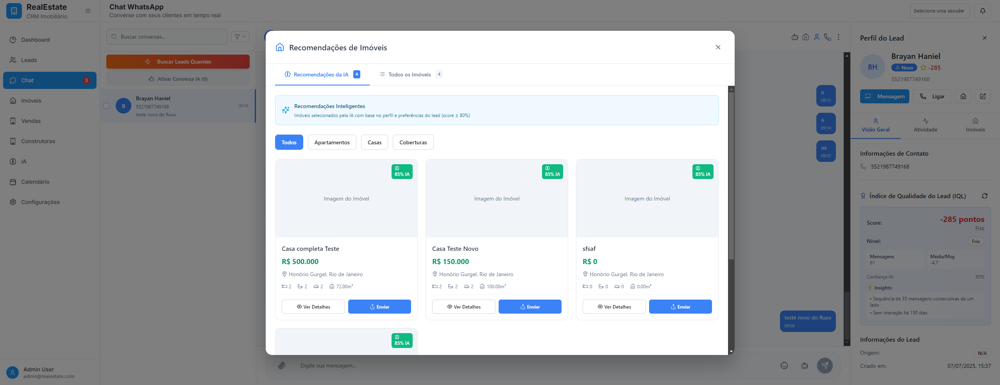
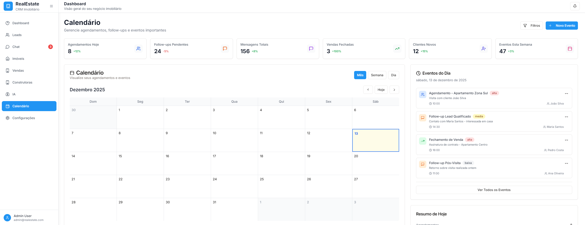
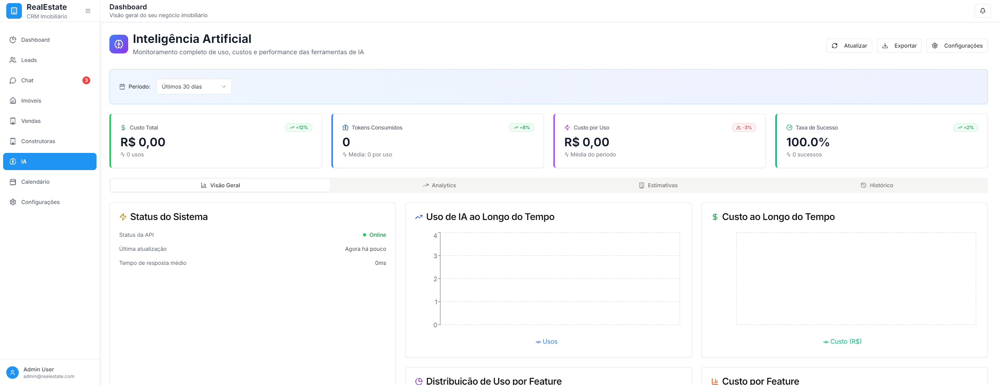
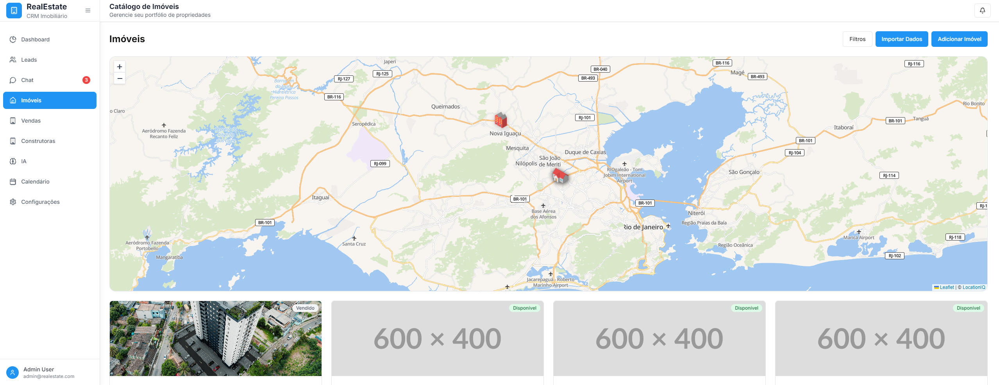

<h1 align="center">CRM Imobiliário</h1>
CRM imobiliário focado em melhorar a eficiencia e qualidade de venda de corretores de imóveis!

---
<h1>Descrição</h1>
Um CRM moderno e um projeto em desenvolvimento com o objetivo de ser um programa completo para o mercado imobiliário, criado para transformar a forma como corretores e imobiliárias gerenciam clientes, imóveis e atendimentos. A plataforma une WhatsApp, automação inteligente e IA em um único ecossistema, aumentando produtividade, organização e taxa de conversão.

Com foco total na experiência do cliente e na eficiência do corretor, o sistema centraliza comunicações, interpreta intenções e automatiza processos que antes consumiam tempo e oportunidades.

<h1>Principais Funcionalidades</h1>

- Integração com múltiplos WhatsApps para envio e recebimento de mensagens em tempo real.
- Centralização de conversas, histórico e dados completos do cliente.
- Catálogo estruturado de imóveis com filtros avançados.
- Busca inteligente de imóveis com base na região e perfil de interesse do cliente.
- Envio instantâneo ao cliente de fotos, descrição técnica e informações completas do imóvel diretamente pelo app.
- Geração automática do perfil e preferências do cliente a partir das conversas.
- IA Gemini para atendimento automatizado, análise de intenção e classificação de leads (quentes, mornos e frios).
- Segmentação inteligente que otimiza a rotina dos corretores e aumenta a taxa de conversão.

<h1>Imagens do projeto</h1>

### Página Calendário

### Página IA

### Página Imoveis

